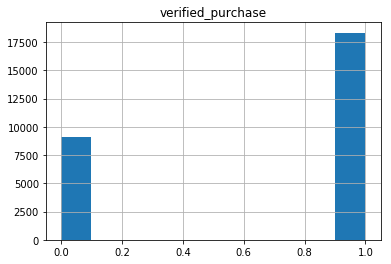
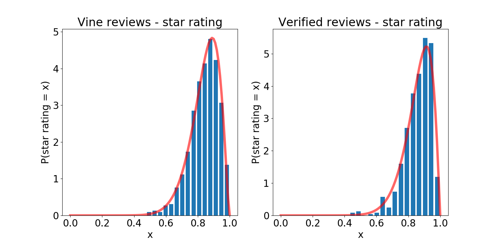
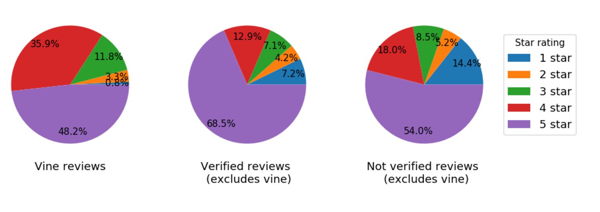

### Motivation:

I chose to analyze reviews that were posted on Amazon as part of their Vine program. Amazon describes this program as being open to their highest ranked reviewers, judged in part by helpfulness of reviews. Amazon together with the vendor provides Vine reviewers with free products in exchange for their reviews.

On one hand, a well-written and authentic review would certainly be valuable to other customers. On the other hand, wouldn’t the reviewer be subconsciously predisposed to viewing a free product in a positive light? My goal is to examine whether vine reviews show any bias and whether they are more helpful than other reviews.

### Data Source
Amazon’s customer review dataset. Because the full dataset includes over 130 million entries, a subset of reviews was chosen. From 10,000,000 imported reviews, a set of 643 unique products was selected which had at least 20 each of vine reviews and verified (but not vine) reviews. The subset of reviews for these products consisted of 100489 individual reviews.

Summary from 49 sample entries:

RangeIndex: 49 entries, 0 to 48   
Data columns (total 15 columns):  
marketplace          49 non-null object  
customer_id          49 non-null int64  
review_id            49 non-null object  
product_id           49 non-null object  
product_parent       49 non-null int64  
product_title        49 non-null object  
product_category     49 non-null object  
star_rating          49 non-null int64  
helpful_votes        49 non-null int64  
total_votes          49 non-null int64  
vine                 49 non-null object  
verified_purchase    49 non-null object  
review_headline      49 non-null object  
review_body          49 non-null object  
review_date          49 non-null object  
dtypes: int64(5), object(10)  
memory usage: 5.8+ KB  

### EDA

From my EDA, I could see that in my dataset, around a quarter of all reviews were from vine reviews. This isn't surprising given that I selected for products with at least 20 vine reviews. About 70% of all reviews are verified purchases. This set is largely mutually exclusive from vine reviews. If a review belonged to both categories, I included it with vine reviews for my analysis.

While the vast majority of reviews have fewer than 50 helpful votes (note log scale), some have helpful votes that number in the hundreds.

Reviewers on a whole are overwhelmingly likely to give a 5 star rating. One star ratings are slightly more frequent than two star ratings suggesting a possible love it or hate it mentality.

The correlation matrix actually shows a negative correlation between star rating and vine review - interesting! There's also a slight positive correlation between vine review and helpful votes received.

### Hypothesis testing

My first hypothesis was that vine reviewers may have some bias, unconscious or otherwise,
in favor of the products they were reviewing due to the fact that they were received
for free.

Average star ratings were calculated for both vine and verified purchases
for each of the 643 products in the set. Averages for each product were used to correct for any inherent quality imbalance in the total set of reviews. The distribution of average star ratings was plotted for both vine and verified purchases and fitted to a beta distribution. Data values were scaled so that the maximum x-value was 1 and the histogram was displayed as a probability density.

The null hypothesis for my test was that the mean of the distribution of
average vine ratings would be identical to that of average verified ratings. The alternate
hypothesis was that the two means would be different.

vines distribution - average score given to each product by vine reviewers.

A Baysian hypothesis test was conducted wherein a point was selected at random from each
beta distribution and the value of the two points was compared. This process was repeated
10,000 times yielding the a probability of 0.4372 that the mean of the vines distribution was larger than the mean of the verified distribution.

It is 43.31 percent probable that the distribution of average
star rating for vine reviews is higher than for verified purchases

It is 54.37 percent probable that the distribution of average
helpful ratio for vine reviews is higher than for verified purchases

It is 49.57 percent probable that the distribution of average
review word count for vine reviews is higher than for verified purchases

run vine_hypothesis.py                                                  
Analysis of 100489 reviews of 643 unique products

Test that the proportion of 1's for vine reviews does not
equal that of verified purchases with a significance level of 0.05
We reject the null hypothesis. P-score: 0.0

Test that the proportion of 2's for vine reviews does not
equal that of verified purchases with a significance level of 0.05
We cannot reject the null hypothesis. P-score: 0.10867728501652096

Test that the proportion of 3's for vine reviews does not
equal that of verified purchases with a significance level of 0.05
We reject the null hypothesis. P-score: 0.0

Test that the proportion of 4's for vine reviews does not
equal that of verified purchases with a significance level of 0.05
We reject the null hypothesis. P-score: 0.0

Test that the proportion of 5's for vine reviews does not
equal that of verified purchases with a significance level of 0.05
We reject the null hypothesis. P-score: 0.0
